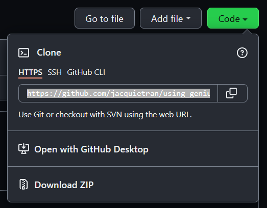

```{r echo = FALSE}

knitr::opts_chunk$set(echo = TRUE)

```

## Introduction

This brief how-to guide covers the steps I follow to:

- Create an API client to access data from [Genius.com](https://genius.com),
- Store API credentials in an `.Renviron` file, and
- Use the `geniusr` package to retrieve song lyrics from [Genius.com](https://genius.com).

These steps have been tested on my PC running Windows 11. On other machines and operating systems, your mileage may vary!

[Here's a general explainer on APIs](https://blog.hubspot.com/website/api-keys) that you may find helpful if you haven't set up an API client before.

### Assumptions

- You have R and RStudio installed on your machine.
- You can install R packages and execute code.
- You are familiar with using GitHub for version control.
- You have GitHub, R, and RStudio connected to one another, as described in ["Happy Git and GitHub for the useR"](https://happygitwithr.com/index.html).

## 1. Create a Genius API client

1. Go to [genius.com](https://genius.com) and sign up for an account or log in if you already have one.

2. Once logged in, [click here to go to the page for creating a Genius API client](https://genius.com/api-clients/new). It will look something like this:

```{r echo = FALSE}


```

3. Fill in the details for your API client - required fields are *App name* and *App website URL*. I filled in the details shown below - when you're ready, click "Save".

```{r echo = FALSE}


```

4. Once your API client has been created, you will be redirected to a page that looks something like the screenshot below, but with the relevant details you filled in for your own API client.

> Important: API keys are not inherently secure, so they should be treated like passwords.

```{r echo = FALSE}


```

5. Keep your web browser open for now - we will come back to grab the relevant API keys later on.

## 2. Store your API credentials in an .Renviron file

Before we press on, it's important to think about how you organise files on your machine for your data science projects. My general approach is:

- Create a new repository on GitHub.
- Clone the repository to my local machine using RStudio, via the "New Project" method described [here in the "Happy Git and GitHub for the useR" ebook](https://happygitwithr.com/new-github-first.html#new-rstudio-project-via-git). I clone the repo so that it is a subdirectory of a folder on my computer called "GitHub".

> I do not have my "GitHub" folder set to sync to any cloud storage services (e.g., Dropbox, OneDrive, and the like). This is very important for the next steps - we want to store the API keys on your local machine only and nowhere else, to reduce the opportunity for someone to steal your API keys!

6. Log in to [Github.com](https://github.com) and create a new repository. After creating a repo, you will be redirected to the home page for that repo. Here's what the repo home page looks like for [jacquietran/geniusr](https://github.com/jacquietran/using_geniusr), just after creating the repo:

```{r echo = FALSE}


```

7. From the home page from your new repo, click the "Code" button and copy the URL to your clipboard.

```{r echo = FALSE}



```

8. Open RStudio. From the top nav bar, go to the "File" menu and click "New Project..." which will open the New Project Wizard.

```{r echo = FALSE}


```

9. Click on "Version control".

```{r echo = FALSE}


```

10. Click on "Git".

```{r echo = FALSE}


```

11. Into the "Repository URL" text box, paste the URL that you copied from your repo home page. This action will auto-populate the "Project directory name" text box. You can also click the "Browse" button if needed to navigate to a location on your machine where you would like to clone your repo as a subdirectory. When you're ready, click "Create Project".

```{r echo = FALSE}


```

12. RStudio will now open you up in a session that corresponds to the GitHub repo you've cloned. For more on how RStudio Projects work, so for more info, check out [Chapter 8 - Workflow: projects](https://r4ds.had.co.nz/workflow-projects.html) from the "R for Data Science" book.

13. Now we're ready to **locally** store your API keys! In RStudio, from the top nav bar, go to the "File" menu, hover over "New file", and from the sub-menu select "Text File".

14. Save this file to your cloned repo, with the filename `.Renviron`. **Note:** This file should be saved in the "top" level of your cloned repo, where the `.Rproj` file is also stored.

15. Go back to your web browser and to the page where your Genius API client details are recorded. If you happen to have closed the page, [click here](https://genius.com/api-clients). Click on the link  "Generate Access Token". After a second or two, a text box will appear with your "Client Access Token". Copy the string inside this text box to your clipboard.

```{r echo = FALSE}


```

15. Go back to RStudio. Edit your `.Renviron` file to add your Genius API token by pasting your Client Access Token where indicated in the screenshot below. Save your changes and close your `.Renviron` file.

> Do not include the [ ] square brackets. They are shown below only to indicate where to paste your Client Access Token.

```{r eval = FALSE}

GENIUS_API_TOKEN = [paste your Client Access Token here]

```

16. Go to your "Git" tab in RStudio. At this stage, you will see the `.Renviron` you have just saved is listed here; this means that this file is being tracked by GitHub - we need to change this because we **do not** want to accidentally share our API keys with the world by uploading the `.Renviron` file to GitHub.

```{r echo = FALSE}

knitr::include_graphics("img/02_08_renviron_in_git_pane.png")

```

17. In RStudio, from your "Files" pane, navigate to the top level of the folder (subdirectory) where you have cloned your repo. You will see a `.gitignore` file in this subdirectory, which was created in the process of cloning the repo to your local machine by creating a new RStudio project. Click on this `.gitignore` file to open it up in the editor pane.

```{r echo = FALSE}


```

18. In the `.gitignore` file, add a line for `.Renviron` and save your changes. My `.gitignore` file now looks like this:

```{r echo = FALSE}


```

19. In RStudio, check your "Git" tab again - you should see that the `.Renviron` file is no longer listed, which means that that file is no longer being tracked. Yay!

## 3. Retrieve song lyrics using R

20. Install the `geniusr` package from CRAN:

```{r eval = FALSE}

install.packages("geniusr")

```

21. Load the `geniusr` library into your session.

```{r}

library(geniusr)

```

22. At the time of preparing this tutorial, there is a bug in the `geniusr` package (described [here](https://github.com/ewenme/geniusr/issues/17)). Until the bug is fixed in the package itself, you can apply a local patch as a workaround (thanks to [MalcolmMashig](https://github.com/ewenme/geniusr/issues/17#issuecomment-989302741)). Copy the code below and run it in your console to apply the local patch:

```{r}

# Load libraries for the workaround patch
library(rvest)
library(xml2)
library(rlang)

get_lyrics <- function (session) {
  lyrics <-  session %>% html_nodes(xpath = '//div[contains(@class, "Lyrics__Container")]')
  song <-  session %>% html_nodes(xpath = '//span[contains(@class, "SongHeaderVariantdesktop__")]') %>% html_text(trim = TRUE)
  artist <-  session %>% html_nodes(xpath = '//a[contains(@class, "SongHeaderVariantdesktop__Artist")]') %>% html_text(trim = TRUE)
  xml_find_all(lyrics, ".//br") %>% xml_add_sibling("p", "\n")
  xml_find_all(lyrics, ".//br") %>% xml_remove()
  lyrics <- html_text(lyrics, trim = TRUE)
  lyrics <- unlist(strsplit(lyrics, split = "\n"))
  lyrics <- grep(pattern = "[[:alnum:]]", lyrics, value = TRUE)
  if (is_empty(lyrics)) {
    return(tibble(line = NA, section_name = NA, section_artist = NA, 
                  song_name = song, artist_name = artist))
  }
  section_tags <- nchar(gsub(pattern = "\\[.*\\]", "", lyrics)) == 0
  sections <- geniusr:::repeat_before(lyrics, section_tags)
  sections <- gsub("\\[|\\]", "", sections)
  sections <- strsplit(sections, split = ": ", fixed = TRUE)
  section_name <- sapply(sections, "[", 1)
  section_artist <- sapply(sections, "[", 2)
  section_artist[is.na(section_artist)] <- artist
  tibble(line = lyrics[!section_tags], section_name = section_name[!section_tags], 
         section_artist = section_artist[!section_tags], song_name = song, 
         artist_name = artist)
}
assignInNamespace("get_lyrics", get_lyrics, "geniusr")

```

23. From the `geniusr` package, use the `get_lyrics_search()` function  to retrieve lyrics from a song based on the artist name and song title. For example, the code below returns a tibble containing the lyrics for the song ["Don't Wanna Try", by the band Saskwatch](https://www.youtube.com/watch?v=3a9_VOxQaWc) (an awesome Melbourne band that is awesome).

```{r, message = FALSE}

# Load {dplyr} for data wrangling
library(dplyr)

get_lyrics_search(
  artist_name = "Saskwatch",
  song_title = "Don't Wanna Try")

```

